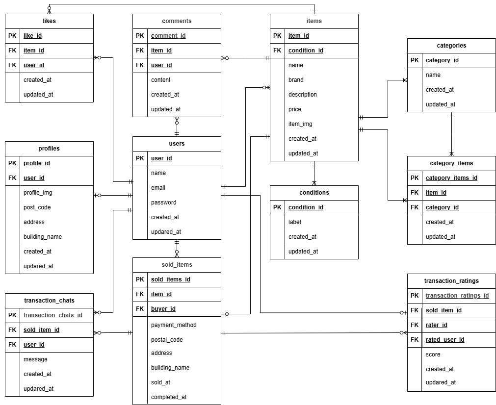

# COACHTECH フリマアプリ

Laravel × Docker で構築したフリマアプリです。ユーザー登録、ログイン、商品出品、検索、コメント、いいね、取引チャット機能などを備えています。

## 環境構築

### Docker ビルド

```bash
git clone https://github.com/maiko2323/fleamarket-app.git
cd fleamarket-app
docker-compose up -d --build
```

### Laravel 環境構築

```bash
docker-compose exec php bash
composer install
cp .env.example .env
環境変数を変更

※下記の「"環境変数の変更"について」を参照
php artisan key:generate
php artisan migrate
php artisan db:seed
php artisan storage:link
```

"環境変数の変更"について.env

#### データベース設定

DB_HOST=mysql

DB_DATABASE=fleamarket

DB_USERNAME=root

DB_PASSWORD=rootpassword

#### メール設定（Mailhog）

MAIL_MAILER=smtp

MAIL_HOST=mailhog

MAIL_PORT=1025

MAIL_FROM_ADDRESS=test@example.com

MAIL_FROM_NAME="FleaMarket App"

## テスト環境設定（PHPUnit）

#### テスト用データベース

`.env.testing` に以下を設定してください。

DB_HOST=mysql

DB_DATABASE=test_database

DB_USERNAME=root

DB_PASSWORD=rootpassword

#### Stripe（テスト環境）

STRIPE_KEY=Stripe の公開可能キー

STRIPE_SECRET=Stripe の公開可能キー

### 開発環境（動作確認用URL）

※ Web ポートは通常 8080 を使用しますが、他アプリとの競合を避けるため本環境では 8083 を使用しています。

[商品一覧(トップページ)](http://localhost:8083/)

[商品一覧(トップページ\_マイリスト)](http://localhost:8083/?tab=mylist)

[会員登録](http://localhost:8083/register)

[ログイン](http://localhost:8083/login)

[商品詳細(例: ID=1 の商品)](http://localhost:8083/item/1)

[商品購入(例: ID=1 の商品)](http://localhost:8083/purchase/1)

[送付先住所変更画面(例: ID=1 の商品)](http://localhost:8083/purchase/address/1)

[商品出品](http://localhost:8083/sell)

[プロフィール](http://localhost:8083/mypage)

[プロフィール編集](http://localhost:8083/mypage/profile)

[プロフィール(購入した商品)](http://localhost:8083/mypage?page=buy)

[プロフィール(出品した商品)](http://localhost:8083/mypage?page=sell)

[プロフィール(取引中の商品)](http://localhost:8083/mypage?page=transaction)

[取引チャット画面（例: soldItem ID=1）](http://localhost:8083/transactions/1)

[phpMyAdmin](http://localhost:8084/)

[MAILHOG](http://localhost:8025/)

## 仕様技術（実行環境）

PHP 8.1.33

Laravel 8.83.29

MySQL 8.0.44

nginx 1.29.3

Docker 28.3.2 / docker-compose 2.39.1

jQuery 3.7.1

Stripe（決済）

Laravel Fortify（認証機能）

FormRequest（バリデーション）

## ER 図



## 追加機能

取引チャット機能の実装

マイページに「取引中の商品」タブを追加

未読メッセージ数の表示

取引完了機能

評価機能の実装

## ユーザーデータ（ダミー）

動作確認用として、以下のユーザーデータを作成しています。

### ユーザー①（出品者）

- 名前：test_user1
- メールアドレス：user1@example.com
- パスワード：password123
- 出品商品：C001〜C005

### ユーザー②（出品者）

- 名前：test_user2
- メールアドレス：user2@example.com
- パスワード：password456
- 出品商品：C006〜C010

### ユーザー③（未紐づけユーザー）

- 名前：test_user3
- メールアドレス：user3@example.com
- パスワード：password789
- 出品・購入なし
